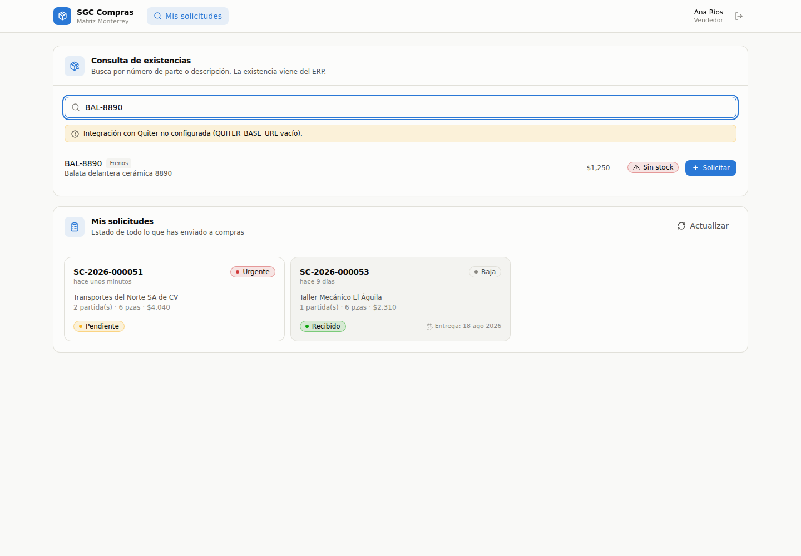
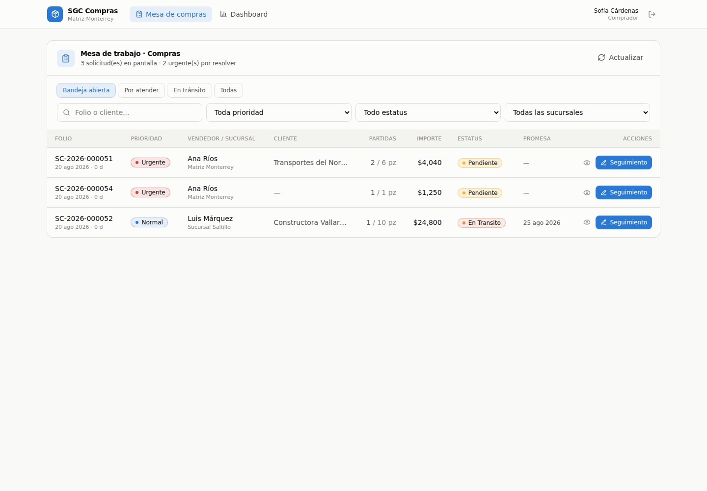
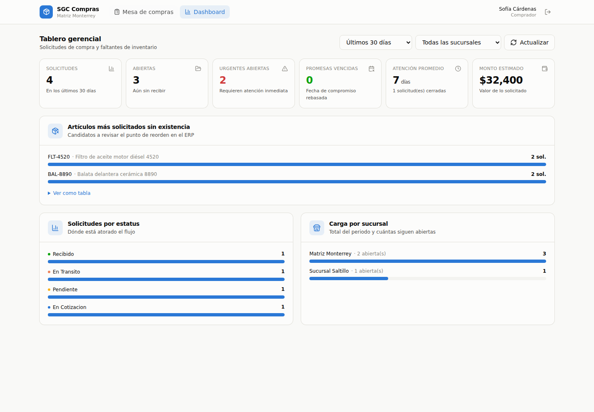
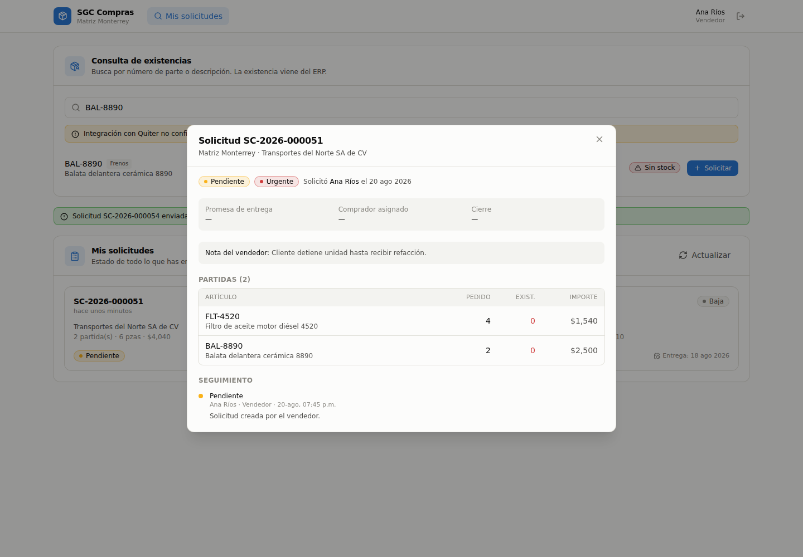

# SGC · Sistema de Gestión de Solicitudes de Compras y Pedidos

Conecta al piso de venta con el equipo de compras, consultando existencias y
precios reales del ERP (**Quiter**) y dejando bitácora de cada movimiento.

**Dos documentos, un solo folio.** Todo nace como **Cotización**: lo que el
vendedor le manda al cliente. Si el cliente aprueba, esa misma cotización se
vuelve **Pedido** — no se copia a ningún lado, es el mismo renglón que cambia
de tipo, así que conserva su folio y su bitácora completa. Si el cliente no
contesta en un mes, se cancela sola.

**Stack:** Node.js + Express + **PostgreSQL** · React (Vite) + Tailwind CSS +
lucide-react + Axios · Autenticación JWT con bcrypt y permisos por rol ·
Exportación a Excel con ExcelJS.

**Dónde vive:** en internet (Railway), como las demás aplicaciones de la empresa.
No necesita estar dentro de la red: las existencias las lee por
`api.catosaapps.lat`, que es pública, igual que la app de Ventas.

---

## 1. Cómo se ve

**Vista Vendedor** — busca la parte, ve la existencia del ERP y, si sale en cero,
levanta la solicitud sin cambiar de pantalla.



**Mesa de Trabajo de Compras** — bandeja filtrable por urgencia, estatus y sucursal.



**Dashboard Gerencial** — KPIs, artículos que más se piden sin existencia y carga por sucursal.



**Detalle y bitácora** — cada movimiento queda registrado con usuario, fecha y comentario.



---

## 2. Probarlo en tu computadora

### 2.1 Node.js

Versión 20 o superior, de [nodejs.org](https://nodejs.org). Para comprobarlo:

```powershell
node --version
```

### 2.2 PostgreSQL

Dos caminos, el que prefieras:

```powershell
# A) Docker, si ya lo tienes: levanta la base y no instala nada más
docker compose up -d

# B) PostgreSQL instalado en la máquina, desde postgresql.org
createdb sgc_compras
```

### 2.3 Configuración

```powershell
cd backend
copy .env.example .env
```

Abre `.env` y llena `DB_USER` y `DB_PASSWORD`. Con Docker ya vienen puestos.

### 2.4 Arrancar

```powershell
cd backend
npm install
npm run db:setup          # crea las tablas y los datos de arranque
npm run build:interfaz    # compila la interfaz
npm start
```

Abre `http://localhost:4000` y entra con cualquiera de estas cuentas
(contraseña `demo1234`):

| Correo | Rol | Qué ve |
|---|---|---|
| `vendedor@demo.mx` | Vendedor | Buscador de existencias y sus solicitudes |
| `comprador@demo.mx` | Comprador | Mesa de trabajo + dashboard |
| `gerente@demo.mx` | Gerente | Todo, incluida la administración de usuarios |

---

## 3. Pruebas automáticas

```powershell
cd backend
npm test
```

| Suite | Qué revisa | ¿Necesita base? |
|---|---|---|
| `npm run test:usuarios` | Contraseñas, seguros de administración y el freno de intentos | No |
| `npm run test:sql` | El SQL que emite la app: sin valores concatenados, dialecto correcto, escrituras solo en tablas propias | No |
| `npm run smoke` | El flujo completo contra la base: alta, permisos por rol, transiciones, dashboard y catálogos | Sí |

`npm run db:estado` no es una prueba, pero sirve para lo mismo: dice en una
línea si la base está alcanzable, si tiene el esquema y cuántos datos hay.

---

## 4. Estructura del proyecto

```
sgc-compras/
├── railway.json  nixpacks.toml   # cómo se construye y arranca en el hospedaje
│
├── database/
│   ├── 01_schema.sql              # tablas, llaves, índices, secuencia y vista
│   ├── 02_seed.sql                # datos de arranque
│   └── 03_migracion_usuarios.sql  # columnas de administración de cuentas
│
├── backend/
│   ├── .env.example
│   ├── scripts/
│   │   ├── prepararNube.js    # decide solo qué hacer con la base al desplegar
│   │   ├── setupDb.js         # instala de cero: BORRA y recrea (db:setup)
│   │   ├── migrarDb.js        # agrega lo que falta, sin borrar (db:migrar)
│   │   ├── estadoDb.js        # diagnóstico de la base en JSON (db:estado)
│   │   ├── smokeTest.js       # prueba end-to-end de la API
│   │   ├── testUsuarios.js    # contraseñas y seguros
│   │   └── validarSql.js      # revisa el SQL emitido, sin base
│   └── src/
│       ├── server.js  app.js
│       ├── config/
│       │   ├── env.js         # única lectura de process.env
│       │   └── db.js          # pool + transacciones + parámetros con nombre
│       ├── middleware/
│       │   ├── auth.js            # JWT + permitirRoles()
│       │   ├── cuenta.js          # cuenta activa y contraseña temporal
│       │   ├── limiteIntentos.js  # freno a quien prueba contraseñas
│       │   └── errorHandler.js
│       ├── routes/  controllers/
│       ├── services/
│       │   ├── solicitudes.service.js   # el SQL de solicitudes
│       │   ├── usuarios.service.js      # altas, roles y contraseñas
│       │   ├── reportes.service.js      # las consultas de los Excel
│       │   ├── excel.js                 # armado de los archivos .xlsx
│       │   └── erp/
│       │       ├── index.js             # fachada: API interna o simulado
│       │       ├── quiterClient.js      # API interna de refacciones
│       │       └── catalogoMock.js      # catálogo simulado de respaldo
│       └── utils/
│           ├── estatus.js     # máquina de estados del flujo
│           ├── password.js    # genera la temporal y valida la elegida
│           └── errors.js
│
├── frontend/
│   ├── public/favicon.svg
│   └── src/
│       ├── api/client.js                  # Axios + JWT + descargas
│       ├── context/AuthContext.jsx
│       ├── lib/constantes.js
│       ├── components/
│       │   ├── Layout.jsx  LogoCatosa.jsx  BotonExcel.jsx
│       │   ├── BuscadorExistencias.jsx  FormularioSolicitud.jsx
│       │   ├── PanelSeguimiento.jsx  DetalleSolicitudModal.jsx
│       │   └── ui/  Primitivos.jsx  Graficos.jsx
│       └── pages/
│           ├── Login.jsx  VendedorPage.jsx  ComprasPage.jsx
│           ├── DashboardPage.jsx  UsuariosPage.jsx  CambiarPassword.jsx
│
└── docker-compose.yml             # PostgreSQL local para desarrollo
```

### 4.1 El logo

`components/LogoCatosa.jsx` trae el logo de CATOSA **vectorizado**, no como
imagen. Se ve nítido a cualquier tamaño, pesa poco y toma su color del texto
que lo rodea (`fill="currentColor"`), así que el mismo archivo sirve en modo
claro y en oscuro.

```jsx
<LogoCatosa className="w-52" />                   // completo, con "CAMIONERA"
<LogoCatosa className="w-24" conBajada={false} /> // solo el círculo y CATOSA
<MarcaCatosa className="w-8" />                   // solo el círculo
```

La bajada "CAMIONERA" se apaga por debajo de unos 140px de ancho, donde ya no
se lee y solo ensucia.

---

## 5. Modelo de datos

```
sucursales ──┐
             ├──< usuarios ──< solicitudes_compras ──< solicitudes_detalle
clientes ────┘                        │
                                      └──< solicitud_historial >── usuarios
```

| Tabla | Para qué sirve |
|---|---|
| `sucursales` | Agencias. `clave` es la clave de ALMACÉN en Quiter. |
| `clientes` | **Copia del padrón de Quiter.** El vigía la refresca cada hora; `origen` distingue los reales de los tres inventados del seed. |
| `usuarios` | Acceso al sistema. `rol` ∈ Vendedor / Comprador / Gerente. `debe_cambiar_password` marca las contraseñas temporales. |
| `solicitudes_compras` | Encabezado: folio, **tipo** (Cotizacion/Pedido), prioridad, estatus, vigencia, promesa de entrega. |
| `solicitudes_detalle` | Partidas. Guarda la **existencia real al momento de solicitar** y **dos precios**: el cotizado y el de hoy. |
| `solicitud_historial` | Bitácora: quién movió qué, cuándo y con qué comentario. |

Detalles que vale la pena conocer:

- **Folio automático** `SC-2026-000001`, armado por una secuencia en el DEFAULT
  de la columna. No depende de la aplicación y no se puede repetir aunque dos
  vendedores capturen al mismo tiempo. **No cambia nunca**, ni siquiera cuando
  la cotización se convierte en pedido: es el mismo documento.
- **Dos columnas de precio, a propósito.** `precio_cotizado` es lo que se le
  prometió al cliente y se congela al enviar la cotización; `precio_lista_actual`
  es lo que Quiter dice hoy y lo refresca el vigía. Nunca se pisan: la única
  forma de saber que un precio subió es tener los dos, y meterlos en una sola
  columna haría que el papel del cliente y la pantalla dejaran de coincidir sin
  que nadie se entere.
- **Índices** para los filtros reales de la operación, incluido el compuesto
  `(estatus_actual, prioridad)` que usa la Mesa de Trabajo.
- `CHECK` en `rol`, `prioridad` y `estatus_actual`: la base rechaza valores que
  no existen en el flujo.
- `ON DELETE CASCADE` en detalle e historial; sin cascada donde borrar rompería
  la trazabilidad.
- El cambio de estatus usa `SELECT ... FOR UPDATE`: dos compradores no pueden
  pisarse el mismo folio.
- De las contraseñas solo se guarda su huella (bcrypt, 10 rondas). No hay forma
  de recuperar una: se restablece y se genera otra temporal.

### Flujo de estatus

**Cotización** — lo que ve el cliente:

```
                        ┌─> Vencida      (pasó el mes sin respuesta)
Borrador ──────────────>│
   │                    ├─> Cancelada    (a mano)
   └─> Con Compras ─────┘
       (si hay faltantes)   └─> Enviada ──> [el cliente aprueba]
                                                    │
                                                    v
```

**Pedido** — lo que ya se está surtiendo:

```
Pendiente ──> Con Proveedor ──> Autorizada ──> En Transito ──> Recibido
    │               │                │              │
    └───────────────┴────────────────┴──────────────┴──> Cancelada / Rechazada
```

Tres cosas que conviene tener claras:

- **`Con Compras` y `Con Proveedor` no son lo mismo.** La primera es una
  cotización con faltantes esperando a que Compras consiga precio y tiempo; la
  segunda es un pedido ya aprobado en el que Compras está negociando con el
  proveedor. `Con Proveedor` se llamaba `En Cotizacion` hasta la migración 04:
  se renombró porque tener dos cosas llamadas "cotización" en la misma pantalla
  no lo entendía nadie.
- **El reloj arranca al enviar, no al capturar.** Una cotización en borrador o
  esperando a Compras no se vence: el cliente todavía no la ha visto.
- Al llegar a un estatus final se sella `fecha_cierre`, que alimenta el KPI de
  tiempo promedio de atención.

### El vigía

`backend/src/services/vigia.js` corre dentro del propio servidor, cada hora,
y hace dos cosas que nadie tiene que acordarse de hacer:

1. **Vence** las cotizaciones enviadas cuyo plazo se cumplió.
2. **Refresca** el precio de Quiter en los documentos vivos. En una cotización
   ya enviada eso NO toca lo que se le prometió al cliente: solo actualiza la
   referencia para poder avisar *"esto subió 8% desde que lo cotizaste"*.
3. **Sincroniza el padrón de clientes** desde `GET /api/clientes` del ERP, para
   que un cliente dado de alta esta mañana se pueda cotizar hoy mismo.

Es seguro que corra dos veces: el `UPDATE` que vence selecciona y escribe en
una sola instrucción, así que nada se vence dos veces ni duplica la bitácora.
Si el ERP no contesta, **no** escribe precios de respaldo: pisar un precio real
con uno inventado lo dejaría guardado como bueno y nadie se enteraría.

### Los clientes

Vienen de Quiter, no se capturan aquí. Tres decisiones que conviene conocer:

- **Se copian a la base local en lugar de consultarse en vivo.** La API del ERP
  devuelve el padrón COMPLETO y no acepta filtro de búsqueda: buscar en vivo
  sería bajar cientos de renglones en cada tecla que teclea el vendedor. Con la
  copia, el buscador responde al instante y sigue sirviendo si el ERP se cae.
- **Un ERP caído no puede vaciar el padrón.** La función que lo lee devuelve
  `null` cuando no pudo preguntar —distinto de una lista vacía— y la
  sincronización se niega a aplicar cualquiera de los dos casos. Sin esa
  distinción, un rato sin red dejaría a todos los vendedores sin clientes.
- **Los clientes no se borran, se desactivan**, igual que los usuarios: una
  cotización del año pasado tiene que seguir sabiendo a quién se le vendió. Los
  tres clientes inventados del seed se apagan solos la primera vez que entra el
  padrón real; en una instalación sin ERP siguen ahí para poder demostrarla.

En `/api/health` se ve de un vistazo cuántos clientes hay y de dónde salieron.

---

## 6. API

Todos los endpoints van bajo `/api` y (salvo `login`, `health` y `meta`)
requieren el header `Authorization: Bearer <token>`.

| Método | Ruta | Rol | Descripción |
|---|---|---|---|
| `GET` | `/health` | — | Estado de la base y de la integración con Quiter. |
| `GET` | `/meta` | — | Estatus, prioridades y transiciones válidas. |
| `POST` | `/auth/login` | — | Devuelve JWT + datos del usuario. |
| `GET` | `/auth/yo` | todos | Perfil del token. |
| `POST` | `/auth/cambiar-password` | todos | Cambio de contraseña propia. |
| `GET` | `/productos/existencias?sku=XXX&almacen=101` | todos | **Consulta al ERP.** |
| `POST` | `/solicitudes` | Vendedor, Gerente | Crea la **cotización** (encabezado + partidas + historial) en **una transacción**. |
| `GET` | `/solicitudes` | todos | Filtros: `tipo`, `id_vendedor`, `prioridad`, `estatus`, `sucursal`, `desde`, `hasta`, `busqueda`, `limite`, `pagina`. |
| `GET` | `/solicitudes/:id` | todos | Encabezado + partidas + bitácora + siguientes estatus + qué puede hacer quien pregunta. |
| `POST` | `/solicitudes/:id/enviar` | Vendedor, Gerente | **Congela el precio** y arranca el plazo de vigencia. |
| `POST` | `/solicitudes/:id/convertir` | Vendedor, Comprador, Gerente | El cliente aprobó: pasa a Pedido **con el mismo folio**. |
| `POST` | `/solicitudes/:id/precios` | todos | Vuelve a preguntarle el precio a Quiter. |
| `PATCH` | `/solicitudes/:id/estatus` | Vendedor, Comprador, Gerente | Cambia estatus, fija promesa y guarda comentario. |
| `GET` | `/dashboard/gerencia?dias=30&sucursal=1` | Comprador, Gerente | KPIs y concentrados. |
| `GET` | `/reportes/solicitudes` · `/reportes/historial` | todos | Excel. Un Vendedor solo baja lo suyo. |
| `GET` | `/reportes/faltantes` · `/reportes/indicadores` | Comprador, Gerente | Excel de gestión. |
| `GET` | `/catalogos/sucursales` | todos | Para los selects. |
| `GET` | `/catalogos/clientes?q=` | todos | Buscador del padrón de Quiter. Devuelve 50 y avisa con `hay_mas` si quedaron fuera. |
| `GET` `POST` `PATCH` | `/usuarios` … | Gerente | Administración de cuentas. |

Reglas de negocio que impone la API, no solo la interfaz:

- Un **Vendedor** solo ve —y solo baja— sus propias solicitudes, aunque mande
  otro `id_vendedor` en la query.
- Un **Vendedor** manda en su cotización (la envía, la manda a Compras, la
  cancela) pero **no** en el flujo de un pedido (**403**): quién consigue la
  pieza y cuándo llega lo registra Compras.
- **`/enviar` se niega si el precio cambió** desde que se armó la cotización:
  responde **409** con la lista de partidas afectadas en `detalles`. No es un
  fallo, es el sistema pidiendo que alguien lo vea antes de comprometer un
  precio con el cliente. Se reintenta con `{ "confirmar": true }`.
- Solo se convierte en pedido una cotización **Enviada** (**409** si no lo está),
  y solo la puede convertir quien la levantó, un Comprador o Gerencia.
- Un estatus de cotización en un pedido —o al revés— se rechaza con **409**, y
  además lo impide un `CHECK` de la propia base.
- Pasar a **En Transito** exige `fecha_promesa_entrega` (**400** si falta).
- Solo se aceptan transiciones válidas del flujo (**409** en cualquier otro caso).
- Mientras alguien traiga contraseña temporal, **toda** la API le responde
  **403** con `codigo: "PASSWORD_TEMPORAL"`, salvo `/auth/yo` y
  `/auth/cambiar-password`.
- Desactivar una cuenta surte efecto en la petición siguiente, no cuando expire
  su token: cada petición protegida revisa el renglón del usuario.
- **Ocho contraseñas equivocadas en 15 minutos bloquean esa cuenta** (**429**)
  el resto de la ventana. Es por cuenta, no por dirección IP: detrás de un
  proxy todas las peticiones llegan de la misma dirección, y limitar por IP
  dejaría fuera a toda la empresa de un golpe.

---

## 7. Usuarios y accesos

Quién entra lo decide el **Gerente**, desde la pestaña **Usuarios**.

### 7.1 Cómo se da de alta a alguien

1. **Usuarios → Nueva cuenta**: nombre, correo, rol y sucursal.
2. El sistema genera una **contraseña temporal** de 14 caracteres y la muestra.
   **Es la única vez que se puede leer**: después solo queda su huella.
3. Se la entregas a la persona.
4. La primera vez que entra, el sistema no la deja hacer nada más que elegir su
   propia contraseña.

Si alguien la olvida: **Usuarios → Contraseña**. Se genera otra temporal.

### 7.2 Qué puede hacer cada rol

| | Vendedor | Comprador | Gerente |
|---|---|---|---|
| Consultar existencias en Quiter | ✓ | ✓ | ✓ |
| Levantar solicitudes | ✓ | | ✓ |
| Ver solicitudes | solo las suyas | todas | todas |
| Mover estatus | | ✓ | ✓ |
| Dashboard | | ✓ | ✓ |
| Bajar sus solicitudes a Excel | ✓ | ✓ | ✓ |
| Bajar faltantes e indicadores | | ✓ | ✓ |
| Administrar usuarios | | | ✓ |

Un **Vendedor** necesita sucursal: es la que se graba en cada solicitud que
levanta. Compras y Gerencia pueden ir sin ella.

**Los compradores no están separados entre sí**: cualquiera ve y mueve todas
las solicitudes. Por eso el jefe de compras no necesita un rol aparte — con
`Comprador` ya supervisa a su equipo, y la bitácora dice quién hizo qué.

### 7.3 Los seguros que impiden quedarse fuera

Los aplica el servidor, no la pantalla:

- Un Gerente **no puede desactivar su propia cuenta** ni **cambiarse el rol**.
- **No se puede dejar el sistema sin Gerentes activos.**
- Las cuentas **no se borran, se desactivan**: el nombre de quien capturó una
  solicitud tiene que seguir apareciendo en su bitácora.
- El **correo no se puede cambiar** después del alta.

### 7.4 Antes de abrir el sistema al equipo

Las cuatro cuentas `@demo.mx` comparten una contraseña que está escrita en este
README.

1. Crea tu cuenta de Gerente con tu correo real.
2. Entra con ella y cambia la contraseña temporal.
3. Crea las cuentas de Compras y las de los vendedores.
4. En **Usuarios**, marca *Incluir desactivadas* y **desactiva las cuatro
   `@demo.mx`**.

Mientras alguna siga activa, la pantalla lo advierte en amarillo y el servidor
lo dice en su bitácora al arrancar.

---

## 8. Los reportes en Excel

Cuatro descargas, desde el botón **Excel** de cada pantalla. Siempre bajan **lo
que estás viendo**: se llevan los mismos filtros que tengas puestos.

| Reporte | Dónde está | Qué trae |
|---|---|---|
| **Solicitudes** | Piso de venta · Mesa de compras | Un renglón por pieza: folio, **tipo**, fecha, vendedor, sucursal, cliente, número de parte, cantidad, existencia al pedir, **precio cotizado, precio de hoy y la variación en %**, importe, fechas de envío / vencimiento / aprobación, promesa y días abierta. |
| **Seguimiento** | Piso de venta · Mesa de compras | La bitácora de cada folio, con las **horas que tardó cada paso**. Como el folio no cambia al convertirse en pedido, el archivo trae la vida entera del documento en un solo hilo. |
| **Faltantes** | Dashboard | Concentrado de lo que se pidió con existencia en cero: piezas, veces, cuántas sucursales lo piden e importe. |
| **Indicadores** | Dashboard | Los números del tablero: resumen, tiempos de atención, y desglose por estatus, sucursal y vendedor. |

La columna **Var. %** es la que contesta la pregunta cara: *¿qué estamos por
vender por debajo de lo que hoy nos cuesta?* Se filtra en Excel por valores
mayores a cero y salen justo esas partidas.

Cada archivo abre listo para trabajarse: encabezado congelado, filtros puestos,
columnas a la medida, fechas como fechas y dinero como dinero. Los totales van
como fórmula `=SUM(...)`, no como número fijo, para que sigan cuadrando si
alguien filtra u ordena en Excel.

Cada archivo lleva además una portada con quién lo bajó, cuándo y con qué
filtros — un Excel reenviado tres veces por correo, sin eso, es un dato sin
origen que nadie puede reproducir.

---

## 9. De dónde salen las existencias

El sistema lee el inventario de Quiter por la **API interna de refacciones**
(`api.catosaapps.lat`), la misma que usa la app de Ventas. Ese servidor ya
tiene la conexión al ERP, así que este sistema no necesita credenciales de base
de datos ni estar dentro de la red.

```
Navegador ──> SGC (Railway) ──> api.catosaapps.lat ──> Quiter (SQL Server, en la empresa)
                    │                                        ▲
                    └──> PostgreSQL (Railway)                 └── solo LECTURA
                         solicitudes, usuarios, bitácora
```

Se usa `GET /api/existencias`, que devuelve la existencia **desglosada por
almacén**. No sirve `/api/productos`: ése suma todos los almacenes en una cifra
y no permite saber si es MI sucursal la que está en cero, que es justo lo que
decide si se compra o se pide un traspaso.

Si `QUITER_BASE_URL` queda vacío, el sistema muestra un **catálogo simulado** y
lo advierte en la interfaz. Sirve para capacitar; las existencias no son reales.

### 9.1 Dos errores a NO repetir

Los dos salieron de leer la tabla real de Quiter, y los dos daban resultados
que *parecían* correctos:

1. **`WHERE i.ALMACEN = 101`** comparando un número contra una columna de texto.
   Quiter tiene almacenes como `102LA`, y al intentar convertirlos truena la
   consulta completa.
2. **`WHERE ... AND a LIKE @b OR c LIKE @b`** sin paréntesis. El `OR` se come el
   filtro de almacén y la búsqueda devuelve artículos de toda la empresa.

Además, Quiter devuelve **renglones repetidos** para un mismo artículo en un
mismo almacén. Hay que sumarlos, no listarlos por separado.

---

## 10. Publicarlo en internet (Railway)

El proyecto trae `railway.json` y `nixpacks.toml`: Railway sabe leerlos y no
hay que configurar el build a mano.

### 10.1 Los pasos

1. En [railway.app](https://railway.app), **New Project → Deploy from GitHub
   repo** y elige `AMHER-MX/sistema-solicitudes-compras`.
2. En el mismo proyecto, **New → Database → Add PostgreSQL**. Railway crea la
   base y publica su `DATABASE_URL`.
3. En el servicio de la aplicación, pestaña **Variables**, agrega:

   | Variable | Valor |
   |---|---|
   | `DATABASE_URL` | `${{Postgres.DATABASE_URL}}` (Railway lo ofrece al escribir `${{`) |
   | `NODE_ENV` | `production` |
   | `JWT_SECRET` | una cadena larga y aleatoria, distinta a la de pruebas |
   | `QUITER_BASE_URL` | `https://api.catosaapps.lat` |

4. **Settings → Networking → Generate Domain**, o conecta un dominio propio.

Al desplegar, `prepararNube.js` revisa la base antes de que el servidor atienda:
si está vacía instala el esquema, y si ya tiene datos aplica solo las
migraciones pendientes. **Nunca borra lo capturado**, así que es seguro
redesplegar cuantas veces haga falta.

### 10.2 Actualizarlo después

`git push` a `main`. Railway reconstruye y republica solo. No hay que entrar a
ningún servidor.

### 10.3 Antes de dárselo al equipo

- [ ] `JWT_SECRET` propio y distinto al de pruebas.
- [ ] `NODE_ENV=production`.
- [ ] `/api/health` responde con la base conectada y el ERP en `QUITER_API`
      (si dice `MOCK`, las existencias serían inventadas).
- [ ] Tu cuenta real de Gerente creada y las cuatro `@demo.mx` desactivadas.

### 10.4 Una reja más, si la quieres

Cloudflare Zero Trust permite poner una puerta de identidad delante del
dominio: quien no traiga un correo de la empresa no llega ni a ver la pantalla
de entrada. No es obligatorio —el sistema ya pide usuario y contraseña, y ya
frena a quien las prueba al azar—, pero para una herramienta interna es la
diferencia entre "protegido por una contraseña" y "ni siquiera visible".

---

## 11. Pendientes

- [ ] Notificación al vendedor cuando su solicitud cambia de estatus, y aviso
      unos días antes de que una cotización se venza (hoy solo lo advierte la
      pantalla cuando entra a verla).
- [ ] Imprimir / mandar por correo la cotización en PDF con el formato de la
      empresa. Hoy el sistema la registra y la controla, pero el papel que ve
      el cliente se sigue armando aparte.
- [ ] Adjuntar cotizaciones del proveedor a la solicitud.
- [ ] Asignar una solicitud a un comprador en particular (hoy cualquiera la toma).
- [ ] Respaldo programado de la base de Railway.

---

## 12. Subir cambios a GitHub

El repositorio es **https://github.com/AMHER-MX/sistema-solicitudes-compras** (privado).

```powershell
git add -A
git commit -m "describe aquí el cambio"
git push
```

`.gitignore` ya excluye `node_modules/`, los archivos `.env` y los builds, así
que **no se suben credenciales**. Los `.env.example` sí se suben: son la
plantilla para armar el propio.
